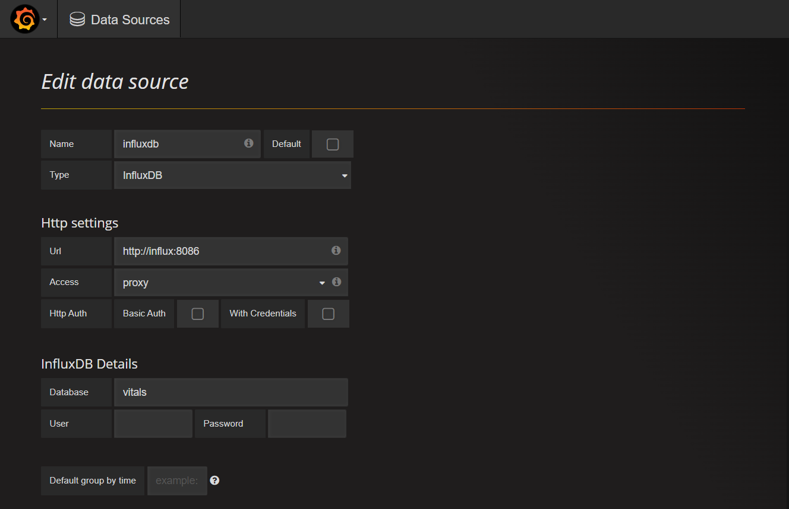
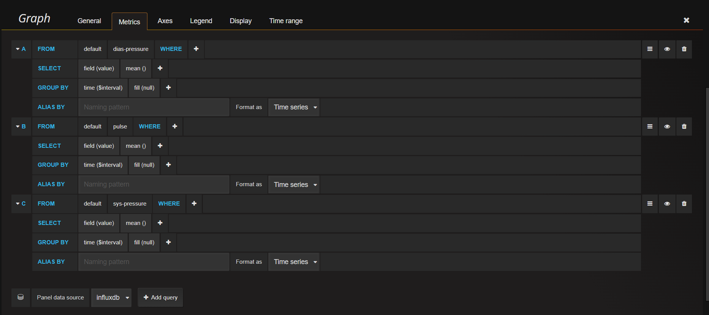

# Projekat 1
## Tema:
Sistem za analizu fizioloških podataka dobijenih sa pametnog sata ili narukvice
### Dataset: 
Blood Pressure Data ([https://dataverse.harvard.edu/file.xhtml?persistentId=doi:10.7910/DVN/EA1SAP/VBHTIQ&version=1.1](https://dataverse.harvard.edu/file.xhtml?persistentId=doi:10.7910/DVN/EA1SAP/VBHTIQ&version=1.1))
### API: 
Youtube API
### Mikroservisi:
- Data mikroservis
- Gateway mikroservis
### Pomoćna aplikacija:
- Sensor App


# Uputstvo

## Pokretanje kontejnera:
U folderu ./Projekat1: 
```
docker-compose up --build
```

## Pokretanje pomoćne aplikacije
U folderu ./Projekat1/sensor-app:
```
npm install
node smartwatch.js
```

## Čitanje vitalnih parametara korisnika
Iz Postman-a slanje GET zahteva Gateway mikroservisu za korisnika čiji je ```ID = 9```:
http://localhost:5000/api/Gateway/GetStatus/9

Response - vitalni parametri korisnika i preporučeni Youtube sadržaj na osnovu analize parametara:
``` json
{
"id":  0,
"healthParameters":  {
"sys":  152,
"dias":  90,
"pulse":  62,
"timestamp":  1656496653533,
"userID":  9
},
"resourceUrl":  "https://www.youtube.com/watch?v=jgpJVI3tDbY",
"resourceTitle":  "The Best of Classical Music 🎻 Mozart, Beethoven, Bach, Chopin, Vivaldi 🎹 Most Famous Classic Pieces"
}
```

## OpenAPI
#### Gateway mikroservis: http://localhost:5000/swagger/index.html
#### Data mikroservis: http://localhost:3333/api-docs/


## Grafana
http://localhost:4200/
Username: admin
Password: admin



