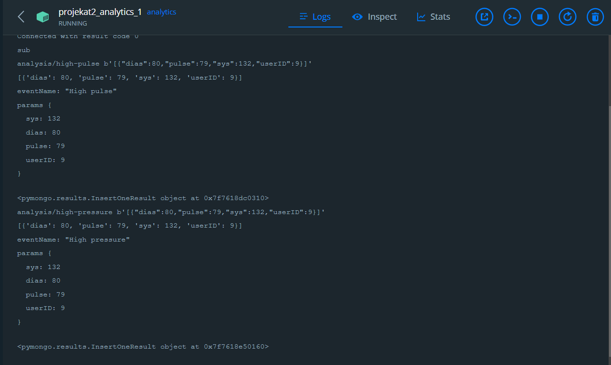
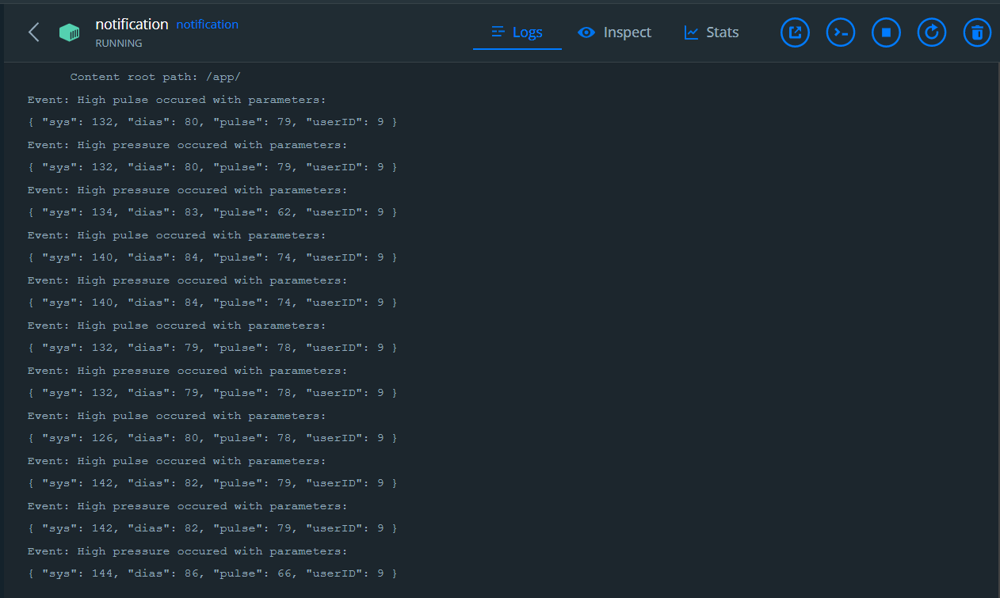

# Projekat 2

## Tema:

Sistem za analizu fizioloških podataka dobijenih sa pametnog sata ili narukvice

### Dataset:

Blood Pressure Data ([https://dataverse.harvard.edu/file.xhtml?persistentId=doi:10.7910/DVN/EA1SAP/VBHTIQ&version=1.1](https://dataverse.harvard.edu/file.xhtml?persistentId=doi:10.7910/DVN/EA1SAP/VBHTIQ&version=1.1))

### API:

Youtube API

### Mikroservisi:

- Data mikroservis

- Gateway mikroservis

- Analytics mikroservis
- Notification mikroservis

### Pomoćna aplikacija:

- Sensor App

  
  
  

# Uputstvo

  

## Pokretanje kontejnera:

U folderu ./Projekat2:

```

docker-compose up --build

```

## Podešavanje Ekuiper-a
Adresa: http://localhost:9082
Username: admin
Password: public

### Kreiranje servisa
Service type: Direct link service
Service name: ekuiper-service
Endpoint: http://ekuiper:9081

### Create stream
Stream Name: vitals
Stream Fields:
- sys - bigint
- dias - bigint
- pulse - bigint
- userID - bigint

Data Source: projekat/vitals
Stream Type: mqtt
Configuration key: default
Stream Format: json
 
### Create rule
#### 1.
**RuleID:** highPulse
**SQL:**  SELECT  *  from vitals WHERE pulse >  70
**Action:** 
- Sink: mqtt
- MQTT broker address: tcp://mqtt:1883
- MQTT topic: analysis/high-pulse

#### 2.
**RuleID:** lowPulse
**SQL:**  SELECT  *  FROM vitals WHERE pulse < 60
**Action:** 
- Sink: mqtt
- MQTT broker address: tcp://mqtt:1883
- MQTT topic: analysis/low-pulse
#### 3.
**RuleID:** highPressure
**SQL:**  SELECT  *  FROM vitals WHERE (sys > 130 OR dias > 90)
**Action:** 
- Sink: mqtt
- MQTT broker address: tcp://mqtt:1883
- MQTT topic: analysis/high-pressure
#### 4.
**RuleID:** lowPressure
**SQL:**  SELECT  *  FROM vitals WHERE (sys < 120 OR dias < 70)
**Action:** 
- Sink: mqtt
- MQTT broker address: tcp://mqtt:1883
- MQTT topic: analysis/low-pressure
## Pokretanje pomoćne aplikacije

U folderu ./Projekat2/sensor-app:

```

npm install

node smartwatch.js

```

 ## Prikaz
 - Analytics mikroservis: 

 - Notification mikroservis: 
