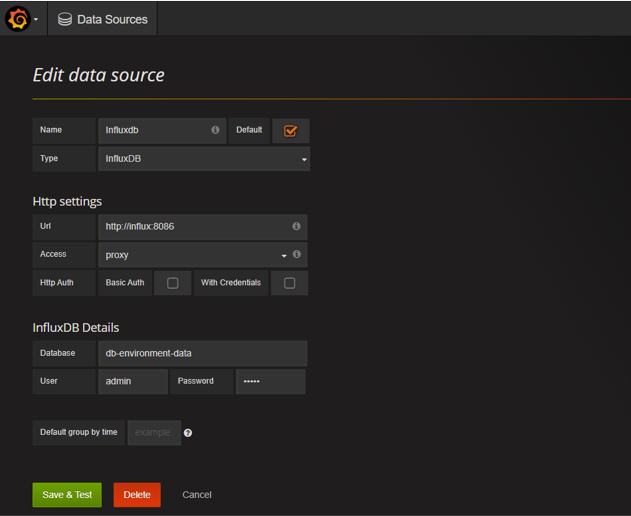
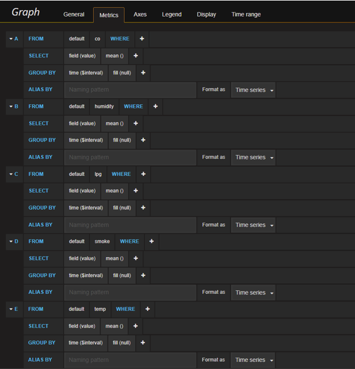
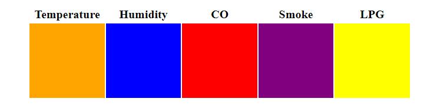

# Projekat 3


## Tema: 
Sistem za praćenje parametara okruženja u okviru industrijskog objekta

### Dataset: 
Environmental Sensor Telemetry Data ([https://www.kaggle.com/datasets/garystafford/environmental-sensor-data-132k](https://www.kaggle.com/datasets/garystafford/environmental-sensor-data-132k))

### Mikroservisi:

- Visualization mikroservis

- Monitoring mikroservis

### Pomoćne aplikacije:

- Sensor Data Generation

- Color App


# Uputstvo

  

## Pokretanje kontejnera:

U folderu ./Projekat3/edgex:

```

docker-compose up --build

```

##  Kreiranje sensor cluster-a:
U folderu ./Projekat3/edgex/device-creation:
``` console
pip install -r requirements.txt
py createSensorCluster.py -ip localhost
```

## Kreiranje device-a:
U folderu ./Projekat3/edgex/device-creation:
``` console
pip install -r requirements.txt
py createRESTDevice.py -ip localhost -devip test-app
```
Provera iz Postman-a: http://localhost:48082/api/v1/device

## Pokretanje senzora:
U folderu Projekat3/edgex/device-service/sensorDataGeneration:
``` console
py genSensorData.py
```

## Grafana
http://localhost:4200/
Username: admin
Password: admin

Kreiranje data source-a:





## Test app
Otvoriti http://localhost:5000
Monitoring mikroservis proverava parametre koje dobija preko brokera i ukoliko su 5 puta zaredom iznad granice menja boju odgovarajuceg kvadrata.
Default granice su za sve parametre 0. Granice se šalju monitoring mikroservisu preko REST API-a.
Promena granica iz Postman-a:
- http://localhost:5007/monitoring/temp/15
- http://localhost:5007/monitoring/humidity/50
- http://localhost:5007/monitoring/smoke/0.2
- http://localhost:5007/monitoring/co/0.05
- http://localhost:5007/monitoring/lpg/0.02

